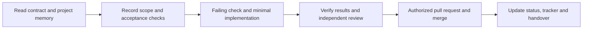

# yao-skills

English | [繁體中文](README.zh.md)

Reusable skills for evidence-based development, independent review, project memory,
and clear technical explanations. **0.8.0** shares the current Yao-Garyu
research-toolkit methodology, including the Taiwan adaptation of `wait-what`.

## Why this repository exists

Yao-Garyu maintains my personal workflow. Yao-skills is the community edition:
people should be able to adopt the decision process with their own projects,
models and tools. The reusable parts are how we define work, verify assumptions,
test changes, handle review findings and preserve enough context to resume.

This repository contains instructions, supporting references, a behavioral template
and an optional Claude Code hook. It does not provision model accounts or an
orchestration service. Configure your own execution and review tools; keep project
contracts authoritative. Fork it, adapt it, and contribute improvements grounded in
actual use.

The [0.8.0 synchronization record](docs/2026-09-13-community-sync.md) records the
source revision and community adaptations. English files are canonical instructions;
Traditional Chinese companions support human reading and maintenance.

## My development workflow

The following is the workflow I use across software and research projects. The
examples summarize inspected project records; they are anonymous and contain no
private results or account configuration. Apply the steps required by the change.
A small, well-defined edit can be completed and checked directly.



1. **Read before proposing.** Start with the specification or README, then
   `status.md`, `tracker.md` and `handover.md`. Inspect the real input and current
   implementation. Use `first-principles` when an inherited assumption controls the
   next decision; ask only for material information that the records cannot resolve.
2. **Make the work reviewable.** For non-trivial work, commit a short plan on a
   feature branch from the project's integration branch. Record the goal, scope,
   checks and stopping condition. An architecture or contract change gets a decision
   record before implementation. Use `workflow-routing` when responsibility or
   delegation needs a decision; a large file count alone does not require a team.
3. **Implement the smallest verified change.** For a bug, reproduce it with a failing
   regression test, make the minimal correction, then run the affected checks. Keep
   the red/green commit history. Documentation-only changes use suitable validators.
4. **Delegate bounded, independent work.** Keep one root responsible for integration.
   Each child gets inputs, owned output paths, acceptance checks and an escalation
   condition. Use qualified native subagents when available; external clients retain
   their own permission and account boundaries. Model and effort choices live in one
   local routing policy, with explicit fallbacks; availability does not justify
   weakening the verification standard.
5. **Review the exact change.** Use `triple-review` when the project requires three
   independent reviews. Verify every finding against source and checks, record
   accepted findings and false positives, repair accepted issues, and review the
   affected diff again. A failed reviewer or an empty response is not approval.
   Ordinary documentation needs validators; research-validity documents follow the
   project's review gate. Merge and deployment stay within existing authorization.
6. **Leave a usable continuation.** Update the three project files at relevant
   milestones. Put changed operator instructions in the runbook. Use `context-hygiene`
   before handing off a long session; preserve the next command and unresolved
   condition before resetting context.

| Project file | What I keep there |
|---|---|
| `status.md` | Current state, evidence, decisions and risks |
| `tracker.md` | Active tasks, dependencies, completion and stopping conditions |
| `handover.md` | What changed, exact continuation point, commands and open questions |

### How this looks in actual work

| Situation | Practice reflected in inspected records | Relevant skill |
|---|---|---|
| Tests depend on configuration in the developer's home directory | Record an isolation plan, reproduce the ambient-setting failure, add a regression test and verify the correction | `first-principles`, `workflow-routing` |
| A reviewer reports a blocking import problem | Check the actual import use and compiler result; record why a false positive is rejected | `triple-review` |
| A feature is implemented but acceptance still needs an operator decision | Keep implementation status and the remaining acceptance condition separate in the three project files | `project-status-review` |
| A research project could expand into a large experiment platform | Run the smallest valid real-data experiment that can decide continue, adjust or stop; inspect the result before expanding | `first-principles`, `workflow-routing` |
| An explanation omits the premise behind a research or engineering decision | Explicitly invoke `wait-what` to restore context, mechanism, evidence and consequences | `wait-what` |

The first three rows summarize recorded development cases. The research row also
reflects the current evidence-first policy; each project's own data, metric and
approval rules determine what can run. The explanation row describes the newly
added skill's intended use; it is not a measured improvement in comprehension.

For research, the first milestone is the earliest credible evidence that can change
a decision. Preserve provenance, data identity, leakage boundaries, metric definitions
and persistent outputs required by that project. Keep invalid or inconclusive runs
visible. Passing a synthetic fixture alone does not establish a real-data result.

Worktrees and full clones belong in persistent sibling directories, for example
`../project-wt-fix`. The shipped `worktree-hygiene` policy puts experiment outputs in
another persistent sibling, such as `../project-runs`, and inventories them before
retirement. Never make temporary storage the only copy of work or evidence.

## Which skill I use

| Skill | Use it when | Expected result |
|---|---|---|
| [first-principles](skills/first-principles/SKILL.md) | A proposed fix, inherited convention or surprising result needs checking | Assumption audit tied to observable evidence |
| [workflow-routing](skills/workflow-routing/SKILL.md) | Planning, implementation or review ownership is unclear | A workflow shape using your local routing policy |
| [triple-review](skills/triple-review/SKILL.md) | The project requires independent multi-model review before merge | Revision-bound reviews, verified triage and a fix log |
| [worktree-hygiene](skills/worktree-hygiene/SKILL.md) | Creating, auditing or retiring worktrees | Ownership and artifact checks before removal |
| [project-status-review](skills/project-status-review/SKILL.md) | You need completed work, blockers and next decisions reconciled | A status report checked against repository evidence |
| [context-hygiene](skills/context-hygiene/SKILL.md) | Context is large or work is moving to a new session | A focused compact or durable handover |
| [wait-what](skills/wait-what/SKILL.md) | You explicitly request a clearer explanation | Taiwan Traditional Chinese explanation with the missing background and precise terms |
| [distilled-caveman-lite-accuracy](skills/distilled-caveman-lite-accuracy/SKILL.md) | You want a shorter answer | Less filler while retaining conditions, identifiers and uncertainty |
| [tc-review](skills/tc-review/SKILL.md) | Preparing Traditional Chinese text | Taiwan vocabulary and terminology checked in context |
| [karpathy-guidelines](skills/karpathy-guidelines/SKILL.md) | Coding needs a reminder about assumptions and scope | Simple, surgical changes with observable completion criteria |

Example requests after installing the corresponding skills:

```text
Use workflow-routing to choose how to implement this accepted plan.
Use first-principles to verify the assumption behind this proposed fix.
Use triple-review for this PR using the reviewers configured for this project.
Use project-status-review to reconcile the current status and outstanding work.
Use wait-what to explain the question, missing premise, mechanism and evidence again.
Use distilled-caveman-lite-accuracy to shorten the answer without removing conditions.
```

`wait-what` is explicit-only: mentioning, installing or discussing it does not
activate it. In Codex, invoke `$wait-what`; in Claude Code's plugin installation,
invoke `/yao-skills:wait-what`. It changes the current explanation and preserves the
ongoing task; it grants no permission to edit files or launch an experiment.

OMC orchestration skills were removed from the source in 0.7.0 and from this
community edition in 0.8.0. Get `plan`, `team`, `ralph`, `autopilot`, `ultrawork`
and related workflows from [oh-my-claudecode](https://github.com/Yeachan-Heo/oh-my-claudecode)
or the runtime-specific distribution you use. Launch persistent workflows only
through an explicit operator request with scope and a stopping condition. Reading
a workflow name in documentation does not launch it.

## Install

### Claude Code

```text
/plugin marketplace add solitude6060/Yao-skills
/plugin install yao-skills@yao-skills
```

The package exposes ten skills under `/yao-skills:<skill-name>`. Reload plugins or
start a new session after installation. See the official
[plugin installation guide](https://code.claude.com/docs/en/discover-plugins).

### Codex and selective local installation

Keep the checkout in a persistent location. For example, these commands install
only `wait-what` for Codex without replacing an existing same-name directory:

```bash
mkdir -p "$HOME/Research" "$HOME/.agents/skills"
git clone https://github.com/solitude6060/Yao-skills.git "$HOME/Research/Yao-skills"
ln -s "$HOME/Research/Yao-skills/skills/wait-what" "$HOME/.agents/skills/wait-what"
```

If the checkout or destination already exists, inspect it and update the existing
installation instead of overwriting it. Codex discovers user skills in
`~/.agents/skills` and supports symlinked skill directories; restart if the skill
has not appeared. `agents/openai.yaml` retains explicit-only invocation for
`wait-what`. You can also ask the built-in `$skill-installer` to install selected
folders from this repository. See [OpenAI's skill documentation](https://learn.chatgpt.com/docs/build-skills).

For other agents, use their documented skill discovery directory or explicitly
reference the selected `SKILL.md` in the agent's instruction file. Check tool
availability and invocation semantics in that runtime. The Claude marketplace
manifest and optional hook are specific to Claude Code.

### Local policy and behavioral template

Merge the relevant parts of [templates/CLAUDE.md](templates/CLAUDE.md) into your
existing project `CLAUDE.md` or `AGENTS.md`; it is an example, not an installer.
Set the specification, integration branch, verification commands and deployment
boundary for that project.

For delegation or independent review, point that instruction file to your routing
policy (default example: `docs/MODEL_ROUTING.md`). Record allowed clients, actual
model identifiers, supported effort, task qualifications, review lanes, account/data
boundaries and permitted fallbacks there. Link task-packet guidance if you maintain
it. These files are project configuration, not bundled model tables. Direct work
can continue without a routing registry; a review that requires unconfigured lanes
must wait for that specific setup.

### Optional hook

[tc-quality-hook](hooks/tc-quality-hook/README.md) is a separately configured
Claude Code `PreToolUse` gate for `AskUserQuestion`. Follow its README to install
it. Installing the skills does not automatically enable the hook; the prompt-based
self-review gate does not prove linguistic correctness.

## Update and validate

For a Claude marketplace install, refresh the marketplace and use the plugin
manager's update action. For a local clone:

```bash
git -C "$HOME/Research/Yao-skills" pull --ff-only
```

Symlink installations follow the updated checkout. Copies need a deliberate refresh;
preserve local modifications and review the 0.8.0 removal list before replacing
older skills. Keep the upstream OMC installation separate.

Maintainers can run the packaging check from the repository root:

```bash
claude plugin validate .
git diff --check
```

The [synchronization record](docs/2026-09-13-community-sync.md) lists the inventory,
portability and bilingual checks used for this release. These checks establish
package consistency; they do not measure skill effectiveness or verify every host.

## License

MIT. See [LICENSE](LICENSE) and [NOTICE.md](NOTICE.md) for original skills,
karpathy-guidelines, the wait-what adaptation and historical OMC attribution.
