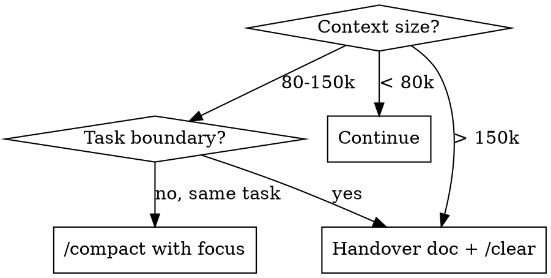

# Context Hygiene

## Overview

Session context grows monotonically — every tool call, file read, and response adds tokens. Even with prompt caching, every turn at high context pays real cost: cached input is **0.1x base (not zero)**, output is **never cached** and costs **5x input**. A 180k-token session costs ~1.8x more per turn than a 30k-token session even with perfect cache hits, and that compounds over a 50-turn session.

The fix is not "cache harder" — it's **reset context at the right moments** via `/compact` (mid-task) or handover-doc + `/clear` (task boundary).

## When to Use



Triggers:
- Context > 100k tokens (check `/context` output)
- About to switch tasks (new feature, new repo area, different concern)
- Starting a long-running loop (ralph, autopilot, `/loop`)
- Session > 4 hours
- Costs spiking unexpectedly

Skip when:
- Context < 80k tokens (trivial sessions)
- Mid tool-call sequence (let the in-flight work finish)
- Inside a TDD red-green cycle (don't compact between failing test and fix — lose the linkage)

## The Cache Misconception

**Common (wrong) belief:** "Long context with cache hits is cheap because cache reads are 0.1x."

Why it's wrong:
- Cached input tokens cost **0.1x base, not zero**
- Output tokens cost **5x input** and are **never cached**
- Cache writes for new prompts cost **1.25x**
- Cache invalidates after ~5 minutes idle — long pauses re-cache from scratch
- Context grows every turn; cache doesn't shrink it

Per-turn cost (input-token-equivalents, assuming 3k output per turn):

| Context | Cached input cost | Output cost | Per-turn total |
|---|---|---|---|
| 30k + 1k new | 30k × 0.1 = 3k | 3k × 5 = 15k | ~19k |
| 90k + 1k new | 90k × 0.1 = 9k | 3k × 5 = 15k | ~25k |
| 180k + 1k new | 180k × 0.1 = 18k | 3k × 5 = 15k | ~34k |

180k vs 30k = **1.8x per turn**. Over 50 turns: **~750k extra tokens**, even with perfect cache hits.

Compact from 180k → 40k drops per-turn cost from ~34k to ~21k = **38% reduction every turn thereafter**.

## /compact: Mid-Task Reset

Use when you want to keep working on the same thing but drop accumulated junk (file dumps, old tool outputs, exploration).

**Always provide a focus prompt** — without it, the model picks what to drop and often drops the wrong thing:

```
/compact focus on the current plan, files touched, code paths under change, and open TODOs. drop full file contents, exploratory tool outputs, and resolved sub-questions.
```

What `/compact` preserves: high-level summary of the conversation, your stated plan, recent decisions.
What it drops: full file contents, intermediate tool result bodies, abandoned threads.

Typical reduction: 180k → 30-50k. Resume from where you were.

## Handover Doc + /clear: Task Boundary Reset

When switching tasks or session is too far gone, **write a handover doc to disk BEFORE `/clear`**. The doc becomes the new session's seed context.

Where to write:
- `docs/HANDOVER.md` (committed, survives across sessions)
- `.omc/notepad.md` (OMC-managed scratch)
- Branch-specific: `docs/HANDOVER_<branch>.md`

**Never** write the handover doc only in the conversation — that's exactly the context you're about to clear.

### Handover template

```markdown
# HANDOVER — 2026-05-19 — <branch / topic>

## Goal
<one sentence: what we're trying to accomplish>

## Status
- [x] Done: <list>
- [~] In progress: <what + file:line>
- [ ] Next: <list>

## Key files / functions
- `path/to/file.py:42` — <why this matters>
- `path/to/test.py:88` — <failing test name>

## Open questions / decisions pending
- <question> — <current leaning>

## Watch out for
- <gotcha>, <prior failure mode>, <constraint from spec/ADR>

## Last commit
<sha + subject>

## How to resume
1. Read this doc
2. <next concrete action>
```

After `/clear`, the first thing the new session does is read this file.

## Loop Sessions (ralph, autopilot, /loop, background)

Long-running loops are the 8+ hour sessions that quietly eat budget. Three mitigations:

1. **Checkpoint every N iterations** — write progress to `.omc/state/` or `docs/PROGRESS.md`. The loop reads the checkpoint on restart, not conversation history.
2. **Restart with fresh context periodically** — kill the loop, `/clear`, restart from checkpoint. Loops should be designed to resume from disk, not memory.
3. **Route inner work to the right tool** — see Subagent Cost Note below. Sonnet for routine implementation, Opus only for architecture/orchestrator decisions; for non-Claude options, complex impl → `codex`, search/long-scan → `gemini-cli`, simple/cheap work → `claude-mm`.

Loop session that's been running 6 hours and "feels fine" is almost certainly accumulating. Check `/context` and usage.

## Subagent Cost Note

Subagent-heavy sessions are a separate cost driver — each subagent runs its own LLM calls in its own context. Mitigations:

- Don't spawn a subagent for what fits in 2-3 inline tool calls
- Batch related questions into one subagent prompt instead of 3 sequential ones
- A subagent that returns a 5k summary lives in your context as 5k, not as the agent's full transcript — so subagents help main-context cost, but their own runs cost separately

### Task-to-tool routing

For one-off subagent work (not full PR workflows — see `research-toolkit:workflow-routing` for that):

| Task shape | Route to | Why |
|---|---|---|
| Architecture / hard trade-off / SPEC-level | Claude **Opus** | Heavy reasoning, deep context |
| Routine implementation / refactor / well-spec'd code | Claude **Sonnet** | ~5x cheaper than Opus, fast, clean impl |
| Complex implementation / algorithmic / multi-file | **codex** (`codex:codex-rescue`) | gpt-5.5 high-effort; OAuth-free if ChatGPT Plus quota available |
| Search / long-context scan / retrieval across many files | **gemini-cli** | Long context window, cheap, good at "find references / summarize across N files" |
| Simple / trivial / classification / cheap bulk work | **claude-mm** (MiniMax) | $0 marginal; saves Claude quota for triage-worthy work |

Default split when in doubt: **Sonnet for impl, Opus only for architecture decisions**. Don't reflex-pick Opus for every subagent — that's where the 30%-from-subagents cost lives.

For PR-scale routing (plan / implement / review chains across A / B / C / D / Mini workflows), use `research-toolkit:workflow-routing` instead — it has the full matrix, elasticity gates, and parallelism hygiene rules.

See also `superpowers:dispatching-parallel-agents` for when subagents pay off vs inline.

## Quick Reference

| Situation | Action |
|---|---|
| `/context` > 100k, same task, mid-flow | `/compact <focus prompt>` |
| Switching to a new feature/area | Write handover → `/clear` → re-read handover |
| Session > 4 hours OR > 150k tokens | Same as above, no exceptions |
| Starting ralph / autopilot / `/loop` | Fresh session — never inherit conversation |
| Loop running > 4 hours | Checkpoint to disk → kill → restart fresh |
| "Should I `/clear` now?" | If asking, yes — but write handover first |
| User says "session太長" / "usage太貴" | This skill applies; offer compact or handover |

## Common Mistakes

- **Compacting too early (< 80k):** wastes the compact, loses useful nuance
- **Compacting without a focus prompt:** model picks what to drop, often drops the important context
- **Clearing without a handover doc:** lose all in-progress mental state and have to re-explore
- **Writing the handover doc inside the conversation:** defeats the purpose — it must be on disk before `/clear`
- **Inheriting a long conversation into a loop:** the loop session starts with 100k of irrelevant context
- **Thinking cache invalidation doesn't matter:** 5-min TTL means a 10-min break re-caches at 1.25x

## Red Flags

- "The cache will save me" → run the math from the table above
- "I'll just continue, compact later" at 150k → already paying ~1.8x per turn
- "The loop has been running fine for 6 hours" → check `/context` and usage
- Writing a handover inside the conversation rather than to disk → wrong layer
- "Just one more thing on this session" past 200k → that one more thing costs 2x

## Related Skills / References

- `research-toolkit:workflow-routing` — PR-scale plan/implement/review routing (A/B/C/D/Mini matrix + elasticity gates)
- `superpowers:writing-plans` — plan files (separate concern, but a plan doc is often the seed of a handover)
- `superpowers:dispatching-parallel-agents` — when subagents are worth the cost
- `codex:codex-rescue` — delegating to codex (gpt-5.5) for complex impl
- User CLAUDE.md §4 "Plan in Files, Not Chat" — same spirit at the plan layer
